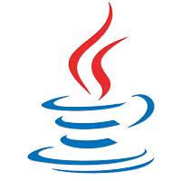
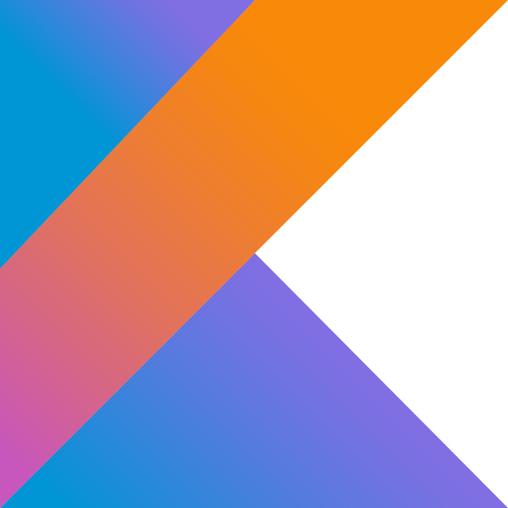
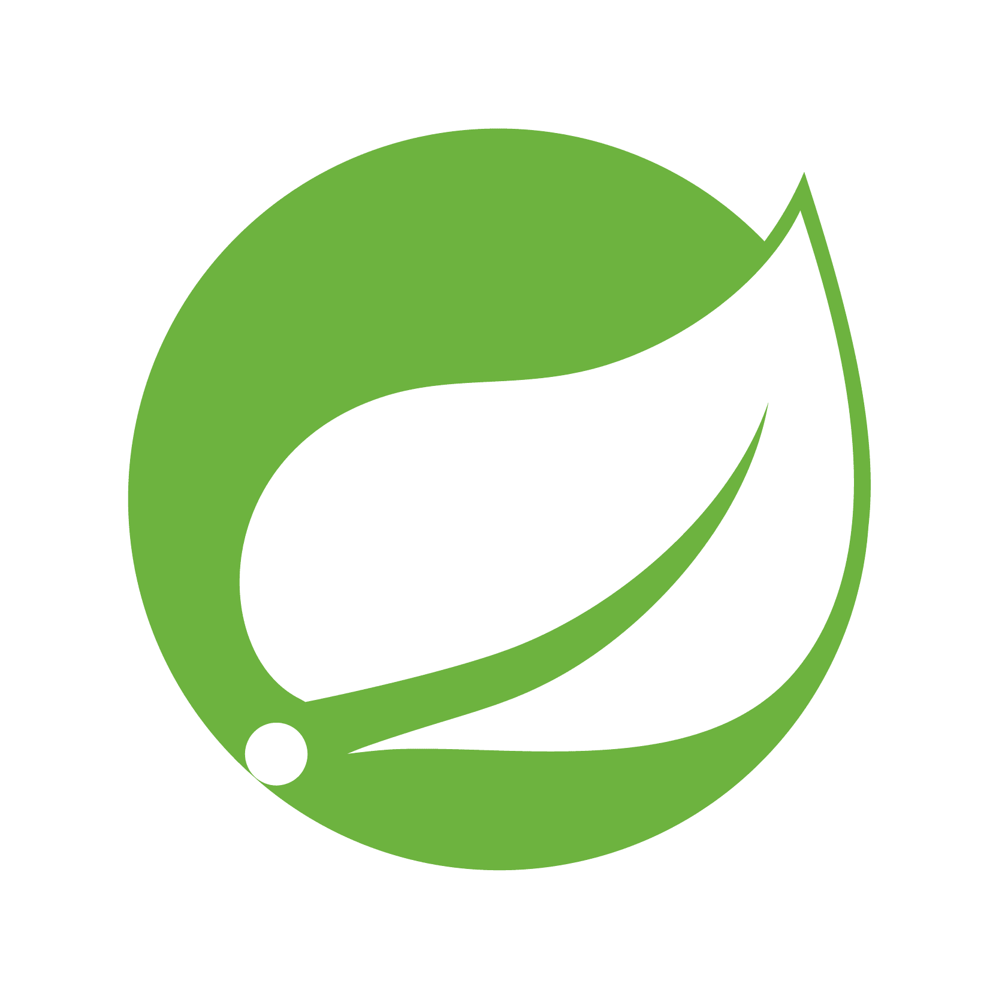
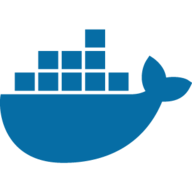

### Hi there, I'm Santiago 👋
## Software developer from pretty Manizales 🇨🇴
Programming is such a fascinating task, it does not matter whether you have a technical or creative mindset, there may be something for you, from creating
awesome mobile animations to microservices, I truly find pleasure on trying new stuff regardless of which area this one is, there will always be something
new and interesting to try. so why wouldn't we try it?

- 🌱 I'm currently studying:
  - Spring boot
  - Gradle
  - Micro services
  - React native
  - Math, complex mobile interactions require some math
- 🥅 One of my personal goals it's to develop native IOS apps ✨
- 🔥 I like a good code challenge from time to time 

#### My tech stack (Skills)

